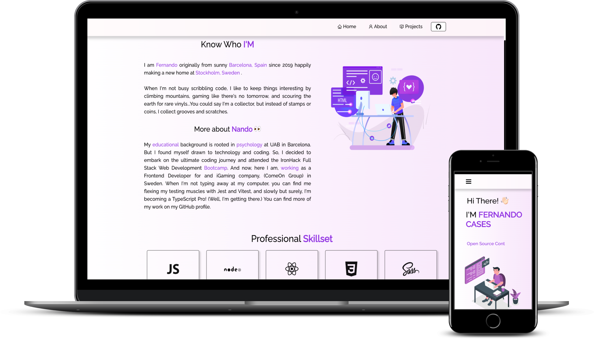

# 🔥 Nando's Portfolio 🚀

[WEB](https://portfolio-nando.vercel.app/)

## Project Description
This project is my personal portfolio, where I share my latest projects made with ReactJS, Tailwind CSS and deployed on Vercel. It's an incredible project, trust me.

## Used Technologies
- ReactJS as a JavaScript framework to build the user interface
- Tailwind CSS as a styling framework to customize the page's appearance
- Vercel as a deployment service to make my portfolio available online.

## Mockup
Here's a picture of what my portfolio would look like:

## Projects
In my portfolio, you'll find a section where you can see all my recent projects. Each project has a detailed description and a link to the source code and/or a demo. They're all pretty cool and I'm super proud of them.

## Deployment
The portfolio is deployed on Vercel, which guarantees fast loading and constant availability. You can access it at the following url: https://portfolio-nando.vercel.app/
